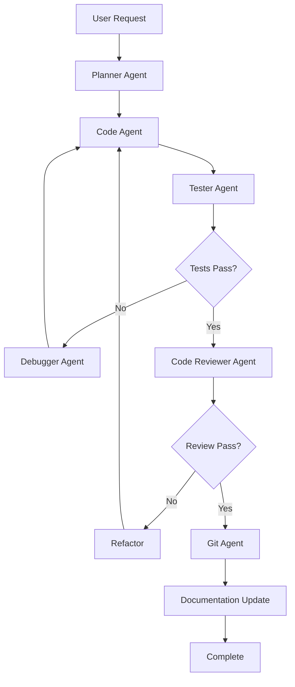

# Workflows

Workflows are the backbone of Mekong Marketing's agent coordination system. They provide detailed instructions that ensure agents work together cohesively and follow project standards.

## What are Workflows?

Workflows are markdown files stored in `.claude/workflows/` that contain:

- Development guidelines and rules
- Agent coordination protocols
- Documentation standards
- Implementation patterns
- Quality assurance procedures

## Workflow Files

Mekong Marketing includes four core workflow files:

### 1. development-rules.md

**Purpose**: Comprehensive development guidelines

**Contains:**
- Code quality standards
- Subagent orchestration rules
- Pre-commit/push procedures
- Implementation principles
- Testing requirements
- Code review criteria

**When Used:**
- During feature implementation
- Before committing code
- During code review
- When refactoring

**Key Sections:**
```markdown
## Code Quality Standards
- TypeScript strict mode
- ESLint configuration
- Prettier formatting
- Test coverage requirements

## Subagent Orchestration
- When to use parallel agents
- Sequential agent workflows
- Agent handoff protocols

## Pre-commit Procedures
- Run tests
- Check types
- Lint code
- Update documentation
```

### 2. documentation-management.md

**Purpose**: Documentation standards and maintenance

**Contains:**
- Documentation structure requirements
- When to update docs
- Documentation formats
- API documentation standards
- Changelog management

**When Used:**
- After implementing features
- During refactoring
- When updating APIs
- For new team members

**Key Sections:**
```markdown
## Documentation Standards
- Code comments
- API documentation
- Architecture diagrams
- User guides

## Update Triggers
- New features
- API changes
- Breaking changes
- Configuration updates

## File Locations
- docs/ - Project documentation
- README.md - Project overview
- CHANGELOG.md - Version history
```

**Why Important:**
- Prevents hallucinations by providing context
- Avoids redundant code creation
- Maintains consistency across codebase

### 3. orchestration-protocol.md

**Purpose**: Methods for coordinating multiple agents

**Contains:**
- Parallel agent initialization
- Sequential agent workflows
- Agent communication patterns
- Task delegation strategies

**When Used:**
- Complex multi-step tasks
- Large feature implementations
- System-wide refactoring
- Performance optimization

**Orchestration Patterns:**

**Parallel Orchestration:**
```markdown
Use when tasks are independent:
- Multiple code reviews
- Concurrent testing
- Parallel documentation updates

Example:
1. Launch scout agents simultaneously
2. Each scans different directories
3. Aggregate results
4. Proceed with unified plan
```

**Sequential Orchestration:**
```markdown
Use when tasks depend on each other:
1. Planner agent creates plan
2. Code agent implements
3. Tester agent validates
4. Reviewer agent checks quality
5. Git agent commits changes
```

**Hybrid Orchestration:**
```markdown
Combine parallel and sequential:
1. Parallel: Scout agents scan codebase
2. Sequential: Planner creates unified plan
3. Parallel: Multiple code agents implement
4. Sequential: Tester validates all changes
5. Sequential: Git agent commits
```

### 4. primary-workflow.md

**Purpose**: End-to-end development workflow

**Contains:**
- Implementation workflow steps
- Testing procedures
- Code review process
- Integration protocols
- Debugging strategies
- Reporting requirements

**Standard Workflow:**



**Workflow Stages:**

1. **Planning**: Analyze requirements, create implementation plan
2. **Implementation**: Write code following standards
3. **Testing**: Run tests, validate functionality
4. **Review**: Check code quality, security, performance
5. **Integration**: Commit changes, update docs
6. **Debugging**: Fix issues if tests or review fail
7. **Reporting**: Document changes and decisions

## How Workflows Work Together

### Example: Implementing a New Feature

```
User: "Add user authentication"

1. Primary Workflow Activates
   ├─ development-rules.md loaded
   └─ Checks code standards

2. Orchestration Protocol Determines Approach
   ├─ Sequential workflow chosen
   └─ Agents queued in order

3. Planner Agent
   ├─ Reads documentation-management.md
   ├─ Reviews docs/system-architecture.md
   └─ Creates implementation plan

4. Code Agent
   ├─ Follows development-rules.md
   ├─ Implements authentication
   └─ Adheres to code standards

5. Tester Agent
   ├─ Runs test suite
   └─ Validates security

6. Code Reviewer Agent
   ├─ Checks against development-rules.md
   └─ Validates best practices

7. Documentation Manager
   ├─ Follows documentation-management.md
   └─ Updates docs/

8. Git Agent
   ├─ Creates conventional commit
   └─ Pushes changes
```

## Workflow Benefits

### Consistency

All agents follow the same rules and patterns, ensuring:
- Uniform code style
- Consistent documentation
- Predictable behavior
- Standardized commits

### Quality Assurance

Workflows enforce:
- Test coverage requirements
- Code review standards
- Security best practices
- Performance benchmarks

### Coordination

Multiple agents work together efficiently:
- Clear handoff protocols
- No duplicate work
- Efficient task distribution
- Proper error handling

### Maintainability

Well-defined workflows make it easier to:
- Onboard new team members
- Update development practices
- Scale projects
- Debug issues

## Customizing Workflows

While CLAUDE.md shouldn't be modified, workflow files can be customized:

### Safe to Modify

✅ **development-rules.md** - Add project-specific rules
✅ **documentation-management.md** - Adjust doc structure
✅ **orchestration-protocol.md** - Define custom patterns

### Example Customization

```markdown
# development-rules.md

## Project-Specific Rules

### API Design
- RESTful endpoints only
- Versioned URLs (/v1/users)
- JSON responses
- Rate limiting required

### Database
- PostgreSQL queries use parameterized statements
- Migrations before code changes
- No raw SQL in business logic
```

### Best Practices for Customization

1. **Document Changes**: Note why custom rules exist
2. **Test Impact**: Verify agents follow new rules
3. **Team Alignment**: Ensure team agrees on changes
4. **Version Control**: Track workflow changes in git
5. **Backup**: Keep original files for reference

## Workflow Validation

Ensure workflows are properly configured:

```bash
# Check workflow files exist
ls .claude/workflows/

# Should show:
# - development-rules.md
# - documentation-management.md
# - orchestration-protocol.md
# - primary-workflow.md

# Verify file contents
cat .claude/workflows/development-rules.md
```

## Common Issues

### Agents Not Following Rules

**Problem**: Agent behavior inconsistent with workflow rules

**Solutions:**
1. Verify workflow files are in correct location
2. Check file permissions (must be readable)
3. Ensure CLAUDE.md references correct paths
4. Review agent logs for errors

### Conflicting Workflows

**Problem**: Different workflows give contradictory instructions

**Solutions:**
1. Review all workflow files for conflicts
2. Establish clear priority order
3. Consolidate overlapping rules
4. Update CLAUDE.md if needed

### Outdated Workflows

**Problem**: Workflows don't match current project needs

**Solutions:**
1. Review and update workflow files
2. Run `ck init` to get latest Mekong Marketing workflows
3. Merge custom changes with updates
4. Document customizations

## Next Steps

Now that you understand workflows:

- [Agents](/docs/agents/) - Learn about the 14 specialized agents
- [Commands](/docs/commands/) - Explore available commands
- [Development Rules](/.claude/workflows/development-rules.md) - Read the full development rules

---

**Key Takeaway**: Workflows ensure all agents follow consistent patterns and coordinate effectively, resulting in high-quality, maintainable code.
