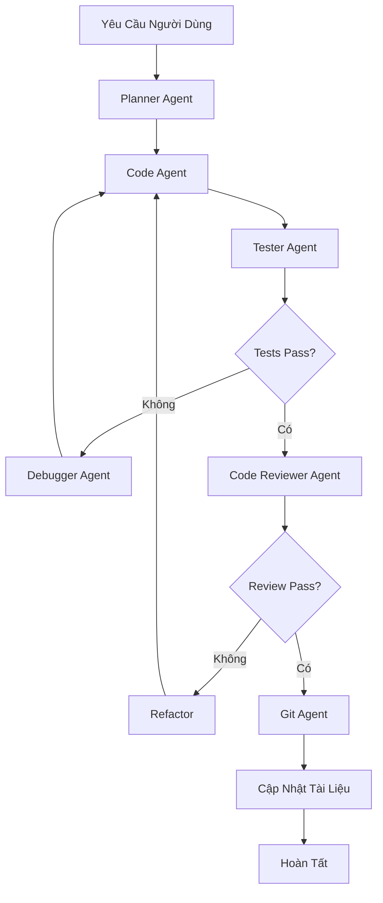

# Workflows

Workflows là xương sống của hệ thống điều phối agent của Mekong Marketing. Chúng cung cấp hướng dẫn chi tiết để đảm bảo các agents làm việc cùng nhau một cách gắn kết và tuân theo tiêu chuẩn dự án.

## Workflows Là Gì?

Workflows là các file markdown được lưu trong `.claude/workflows/` chứa:

- Hướng dẫn và quy tắc phát triển
- Giao thức điều phối agent
- Tiêu chuẩn tài liệu
- Patterns triển khai
- Quy trình đảm bảo chất lượng

## Các File Workflow

Mekong Marketing bao gồm bốn file workflow cốt lõi:

### 1. development-rules.md

**Mục Đích**: Hướng dẫn phát triển toàn diện

**Chứa:**
- Tiêu chuẩn chất lượng code
- Quy tắc điều phối subagent
- Quy trình pre-commit/push
- Nguyên tắc triển khai
- Yêu cầu testing
- Tiêu chí code review

**Khi Sử Dụng:**
- Trong quá trình triển khai tính năng
- Trước khi commit code
- Trong code review
- Khi refactoring

**Các Phần Chính:**
```markdown
## Code Quality Standards
- TypeScript strict mode
- Cấu hình ESLint
- Định dạng Prettier
- Yêu cầu test coverage

## Subagent Orchestration
- Khi nào sử dụng parallel agents
- Sequential agent workflows
- Giao thức chuyển giao agent

## Pre-commit Procedures
- Chạy tests
- Kiểm tra types
- Lint code
- Cập nhật tài liệu
```

### 2. documentation-management.md

**Mục Đích**: Tiêu chuẩn và bảo trì tài liệu

**Chứa:**
- Yêu cầu cấu trúc tài liệu
- Khi nào cập nhật docs
- Định dạng tài liệu
- Tiêu chuẩn tài liệu API
- Quản lý changelog

**Khi Sử Dụng:**
- Sau khi triển khai tính năng
- Trong quá trình refactoring
- Khi cập nhật APIs
- Cho thành viên mới trong team

**Các Phần Chính:**
```markdown
## Documentation Standards
- Comments trong code
- Tài liệu API
- Sơ đồ kiến trúc
- Hướng dẫn người dùng

## Update Triggers
- Tính năng mới
- Thay đổi API
- Breaking changes
- Cập nhật cấu hình

## File Locations
- docs/ - Tài liệu dự án
- README.md - Tổng quan dự án
- CHANGELOG.md - Lịch sử phiên bản
```

**Tại Sao Quan Trọng:**
- Ngăn hallucinations bằng cách cung cấp context
- Tránh tạo code trùng lặp
- Duy trì tính nhất quán trong codebase

### 3. orchestration-protocol.md

**Mục Đích**: Phương pháp điều phối nhiều agents

**Chứa:**
- Khởi tạo parallel agent
- Sequential agent workflows
- Patterns giao tiếp agent
- Chiến lược phân công tác vụ

**Khi Sử Dụng:**
- Tác vụ đa bước phức tạp
- Triển khai tính năng lớn
- Refactoring toàn hệ thống
- Tối ưu hiệu suất

**Patterns Điều Phối:**

**Điều Phối Song Song:**
```markdown
Sử dụng khi các tác vụ độc lập:
- Nhiều code reviews
- Testing đồng thời
- Cập nhật tài liệu song song

Ví dụ:
1. Khởi chạy scout agents đồng thời
2. Mỗi agent quét các thư mục khác nhau
3. Tổng hợp kết quả
4. Tiến hành với kế hoạch thống nhất
```

**Điều Phối Tuần Tự:**
```markdown
Sử dụng khi các tác vụ phụ thuộc lẫn nhau:
1. Planner agent tạo kế hoạch
2. Code agent triển khai
3. Tester agent xác thực
4. Reviewer agent kiểm tra chất lượng
5. Git agent commit thay đổi
```

**Điều Phối Kết Hợp:**
```markdown
Kết hợp song song và tuần tự:
1. Song song: Scout agents quét codebase
2. Tuần tự: Planner tạo kế hoạch thống nhất
3. Song song: Nhiều code agents triển khai
4. Tuần tự: Tester xác thực tất cả thay đổi
5. Tuần tự: Git agent commit
```

### 4. primary-workflow.md

**Mục Đích**: Workflow phát triển từ đầu đến cuối

**Chứa:**
- Các bước workflow triển khai
- Quy trình testing
- Quy trình code review
- Giao thức tích hợp
- Chiến lược debugging
- Yêu cầu báo cáo

**Workflow Tiêu Chuẩn:**



**Các Giai Đoạn Workflow:**

1. **Lập Kế Hoạch**: Phân tích yêu cầu, tạo kế hoạch triển khai
2. **Triển Khai**: Viết code theo tiêu chuẩn
3. **Testing**: Chạy tests, xác thực chức năng
4. **Review**: Kiểm tra chất lượng code, bảo mật, hiệu suất
5. **Tích Hợp**: Commit thay đổi, cập nhật docs
6. **Debugging**: Sửa lỗi nếu tests hoặc review thất bại
7. **Báo Cáo**: Tài liệu hóa thay đổi và quyết định

## Cách Workflows Làm Việc Cùng Nhau

### Ví Dụ: Triển Khai Tính Năng Mới

```
Người dùng: "Thêm xác thực người dùng"

1. Primary Workflow Kích Hoạt
   ├─ development-rules.md được tải
   └─ Kiểm tra code standards

2. Orchestration Protocol Xác Định Cách Tiếp Cận
   ├─ Chọn sequential workflow
   └─ Xếp hàng agents theo thứ tự

3. Planner Agent
   ├─ Đọc documentation-management.md
   ├─ Xem xét docs/system-architecture.md
   └─ Tạo kế hoạch triển khai

4. Code Agent
   ├─ Tuân theo development-rules.md
   ├─ Triển khai authentication
   └─ Tuân thủ code standards

5. Tester Agent
   ├─ Chạy test suite
   └─ Xác thực bảo mật

6. Code Reviewer Agent
   ├─ Kiểm tra với development-rules.md
   └─ Xác thực best practices

7. Documentation Manager
   ├─ Tuân theo documentation-management.md
   └─ Cập nhật docs/

8. Git Agent
   ├─ Tạo conventional commit
   └─ Push thay đổi
```

## Lợi Ích Của Workflows

### Tính Nhất Quán

Tất cả agents tuân theo cùng quy tắc và patterns, đảm bảo:
- Code style đồng nhất
- Tài liệu nhất quán
- Hành vi dự đoán được
- Commits tiêu chuẩn hóa

### Đảm Bảo Chất Lượng

Workflows thực thi:
- Yêu cầu test coverage
- Tiêu chuẩn code review
- Best practices bảo mật
- Benchmarks hiệu suất

### Điều Phối

Nhiều agents làm việc cùng nhau hiệu quả:
- Giao thức chuyển giao rõ ràng
- Không có công việc trùng lặp
- Phân phối tác vụ hiệu quả
- Xử lý lỗi đúng cách

### Khả Năng Bảo Trì

Workflows được định nghĩa rõ ràng giúp dễ dàng hơn:
- Onboard thành viên mới trong team
- Cập nhật thực hành phát triển
- Scale dự án
- Debug vấn đề

## Tùy Chỉnh Workflows

Mặc dù CLAUDE.md không nên sửa đổi, các file workflow có thể được tùy chỉnh:

### An Toàn Để Sửa Đổi

✅ **development-rules.md** - Thêm quy tắc cụ thể cho dự án
✅ **documentation-management.md** - Điều chỉnh cấu trúc doc
✅ **orchestration-protocol.md** - Định nghĩa patterns tùy chỉnh

### Ví Dụ Tùy Chỉnh

```markdown
# development-rules.md

## Project-Specific Rules

### API Design
- Chỉ RESTful endpoints
- URLs có phiên bản (/v1/users)
- JSON responses
- Rate limiting bắt buộc

### Database
- PostgreSQL queries sử dụng parameterized statements
- Migrations trước khi thay đổi code
- Không có raw SQL trong business logic
```

### Best Practices Cho Tùy Chỉnh

1. **Tài Liệu Hóa Thay Đổi**: Ghi chú tại sao quy tắc tùy chỉnh tồn tại
2. **Test Tác Động**: Xác minh agents tuân theo quy tắc mới
3. **Căn Chỉnh Team**: Đảm bảo team đồng ý với thay đổi
4. **Version Control**: Theo dõi thay đổi workflow trong git
5. **Backup**: Giữ các file gốc để tham khảo

## Xác Thực Workflow

Đảm bảo workflows được cấu hình đúng:

```bash
# Kiểm tra các file workflow tồn tại
ls .claude/workflows/

# Nên hiển thị:
# - development-rules.md
# - documentation-management.md
# - orchestration-protocol.md
# - primary-workflow.md

# Xác minh nội dung file
cat .claude/workflows/development-rules.md
```

## Vấn Đề Thường Gặp

### Agents Không Tuân Theo Quy Tắc

**Vấn Đề**: Hành vi agent không nhất quán với quy tắc workflow

**Giải Pháp:**
1. Xác minh các file workflow ở vị trí đúng
2. Kiểm tra quyền file (phải đọc được)
3. Đảm bảo CLAUDE.md tham chiếu đường dẫn đúng
4. Xem xét logs agent để tìm lỗi

### Workflows Xung Đột

**Vấn Đề**: Các workflows khác nhau đưa ra hướng dẫn mâu thuẫn

**Giải Pháp:**
1. Xem xét tất cả file workflow để tìm xung đột
2. Thiết lập thứ tự ưu tiên rõ ràng
3. Hợp nhất các quy tắc chồng chéo
4. Cập nhật CLAUDE.md nếu cần

### Workflows Lỗi Thời

**Vấn Đề**: Workflows không phù hợp với nhu cầu dự án hiện tại

**Giải Pháp:**
1. Xem xét và cập nhật các file workflow
2. Chạy `mk init` để nhận workflows Mekong Marketing mới nhất
3. Hợp nhất thay đổi tùy chỉnh với cập nhật
4. Tài liệu hóa customizations

## Bước Tiếp Theo

Bây giờ bạn đã hiểu workflows:

- [Agents](/docs/agents/) - Tìm hiểu về 14 agents chuyên biệt
- [Commands](/docs/commands/) - Khám phá các lệnh có sẵn
- [Development Rules](/.claude/workflows/development-rules.md) - Đọc development rules đầy đủ

---

**Điểm Chính**: Workflows đảm bảo tất cả agents tuân theo patterns nhất quán và điều phối hiệu quả, tạo ra code chất lượng cao, dễ bảo trì.
