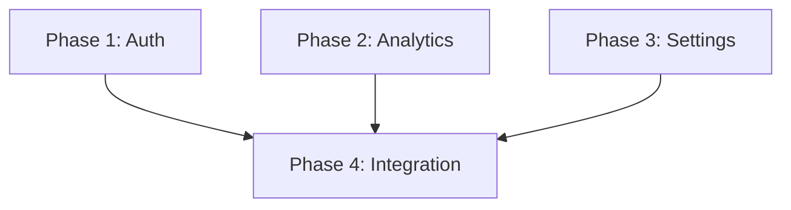

# /plan:parallel

---

## 🤖 Quick Execute

```
Execute: https://agencyos.network/docs/commands/plan/parallel
```


Parallel execution planning command. Creates implementation plans with phases that can run simultaneously, using dependency graphs and file ownership boundaries to prevent conflicts.

## Syntax

```bash
/plan:parallel [task]
```

## When to Use

- **Independent Modules**: Features that don't share files
- **Multi-Agent Execution**: When you want parallel agent execution
- **Large Features**: Breaking work into concurrent streams
- **Team Parallelization**: Multiple developers working simultaneously

## Quick Example

```bash
/plan:parallel [implement user dashboard with auth, analytics, and settings modules]
```

**Output**:
```
Creating parallel execution plan...

## Dependency Graph

Phase 1: Auth Module (no deps)
Phase 2: Analytics Module (no deps)
Phase 3: Settings Module (no deps)
Phase 4: Dashboard Integration (depends on 1, 2, 3)

## Parallelization Strategy

Wave 1 (Parallel): Phase 1 + Phase 2 + Phase 3
Wave 2 (Sequential): Phase 4

## File Ownership Matrix

Phase 1: src/auth/*, src/middleware/auth.ts
Phase 2: src/analytics/*, src/hooks/useAnalytics.ts
Phase 3: src/settings/*, src/hooks/useSettings.ts
Phase 4: src/dashboard/*, src/pages/dashboard.tsx

Plan saved: plans/251129-dashboard/plan.md
Execute with: /code:parallel
```

## Arguments

- `[task]`: Description of multi-component feature to plan (required)

## Key Concepts

### Dependency Graph

Shows which phases depend on other phases:

```
Phase 1 (Auth) ────────┐
                       ├──→ Phase 4 (Integration)
Phase 2 (Analytics) ───┤
                       │
Phase 3 (Settings) ────┘
```

- **No deps**: Phase can start immediately
- **Depends on X**: Must wait for X to complete
- **Parallel**: Multiple phases with no shared dependencies

### File Ownership Matrix

Assigns exclusive file access to each phase:

```
Phase 1: src/auth/**
Phase 2: src/analytics/**
Phase 3: src/settings/**
Phase 4: src/dashboard/**, src/app.tsx
```

**Why File Ownership?**
- Prevents merge conflicts
- Enables true parallel execution
- Clear boundaries for agents
- No coordination needed between parallel phases

### Parallelization Strategy

Groups phases into execution waves:

```
Wave 1 (Parallel):
├── Phase 1: Auth Module
├── Phase 2: Analytics Module
└── Phase 3: Settings Module

Wave 2 (Sequential):
└── Phase 4: Dashboard Integration
```

- **Parallel wave**: All phases run simultaneously
- **Sequential wave**: Waits for previous wave to complete

## Plan Structure

Generated plans include these sections:

```markdown
# Plan: [Task Name]

## Overview
Brief description of the implementation

## Dependency Graph


## File Ownership Matrix

| Phase | Owned Files | Shared (Read-Only) |
|-------|-------------|-------------------|
| Phase 1 | src/auth/* | src/types/* |
| Phase 2 | src/analytics/* | src/types/* |
| Phase 3 | src/settings/* | src/types/* |
| Phase 4 | src/dashboard/* | All above |

## Parallelization Strategy

### Wave 1 (Parallel Execution)
- Phase 1, Phase 2, Phase 3 can run simultaneously
- No dependencies between these phases
- Estimated time: 2 hours (longest phase)

### Wave 2 (Sequential)
- Phase 4 requires all Wave 1 phases complete
- Integrates all modules
- Estimated time: 1 hour

## Phases

### Phase 1: Auth Module
[Detailed implementation steps]

### Phase 2: Analytics Module
[Detailed implementation steps]

...
```

## Complete Example

### Scenario: E-commerce Checkout System

```bash
/plan:parallel [build checkout system with cart, payment, shipping, and order confirmation]
```

**Generated Plan**:

```markdown
# Plan: E-commerce Checkout System

## Overview
Multi-module checkout system with independent cart, payment,
shipping calculation, and order confirmation components.

## Dependency Graph

```
Cart ──────────────────┐
                       │
Payment Gateway ───────┼──→ Order Processing ──→ Confirmation
                       │
Shipping Calculator ───┘
```

## File Ownership Matrix

| Phase | Exclusive Files | Notes |
|-------|-----------------|-------|
| Phase 1: Cart | src/cart/*, src/hooks/useCart.ts | Cart state management |
| Phase 2: Payment | src/payment/*, src/hooks/usePayment.ts | Stripe integration |
| Phase 3: Shipping | src/shipping/*, src/hooks/useShipping.ts | Rate calculation |
| Phase 4: Orders | src/orders/*, src/hooks/useOrder.ts | Order creation |
| Phase 5: UI | src/checkout/*, src/pages/checkout.tsx | Final integration |

**Shared (Read-Only)**:
- src/types/* - Type definitions
- src/utils/* - Utility functions
- src/config/* - Configuration

## Parallelization Strategy

### Wave 1: Independent Modules (Parallel)

**Phase 1: Cart Module** [2 agents]
- Cart state management (Zustand)
- Add/remove/update items
- Cart persistence (localStorage)
- Cart summary calculations

**Phase 2: Payment Gateway** [1 agent]
- Stripe integration
- Payment intent creation
- Card validation
- Error handling

**Phase 3: Shipping Calculator** [1 agent]
- Address validation
- Rate calculation API
- Shipping method selection
- Delivery estimation

**Execution**: All three phases run simultaneously
**Duration**: ~2 hours (determined by longest phase)

### Wave 2: Order Processing (Sequential)

**Phase 4: Order Processing** [1 agent]
- Depends on: Phase 1, 2, 3
- Order creation service
- Inventory deduction
- Payment capture
- Shipping label generation

**Execution**: Starts after Wave 1 complete
**Duration**: ~1.5 hours

### Wave 3: UI Integration (Sequential)

**Phase 5: Checkout UI** [1 agent]
- Depends on: Phase 4
- Multi-step checkout flow
- Form validation
- Order review page
- Confirmation page

**Execution**: Starts after Wave 2 complete
**Duration**: ~1 hour

## Execution Command

```bash
# Execute all phases with parallel support
/code:parallel @plans/251129-checkout/plan.md
```

## Success Criteria

- [ ] Cart operations work independently
- [ ] Payment processes without cart dependency
- [ ] Shipping calculates before payment
- [ ] Order combines all modules
- [ ] No file conflicts between phases
```

## Use Cases

### Independent Feature Modules

```bash
/plan:parallel [build admin panel with user management, content management, and analytics]
```

Three independent modules, one integration phase.

### Microservices Setup

```bash
/plan:parallel [create microservices for auth, products, orders, and notifications]
```

Each service is a separate phase with its own file ownership.

### Component Library

```bash
/plan:parallel [build UI component library with buttons, forms, modals, and tables]
```

Each component category is an independent phase.

### API Endpoint Groups

```bash
/plan:parallel [implement REST API with users, products, orders, and search endpoints]
```

Each endpoint group can be developed in parallel.

## Execution

After creating a parallel plan, execute with:

```bash
# Execute with parallel agent support
/code:parallel @plans/251129-{task}/plan.md
```

The `/code:parallel` command:
1. Reads dependency graph
2. Launches parallel agents for Wave 1
3. Waits for wave completion
4. Proceeds to next wave
5. Repeats until all waves complete

## Best Practices

### Clear Module Boundaries

Define tasks with natural separation:

```bash
# Good: Clear boundaries
/plan:parallel [build auth service, payment service, and notification service]

# Harder to parallelize
/plan:parallel [build user profile with settings and preferences]
```

### Minimize Shared Files

Keep shared files to read-only types/utils:

```
✅ Good structure:
src/auth/         # Phase 1 owns
src/payment/      # Phase 2 owns
src/types/        # Shared, read-only

❌ Problematic:
src/services/auth.ts    # Phase 1
src/services/payment.ts # Phase 2
src/services/index.ts   # Both need to modify!
```

### Right-Size Phases

Balance parallel gains vs. coordination overhead:

```bash
# Too granular (overhead > benefit)
/plan:parallel [implement login button, logout button, profile button]

# Better granularity
/plan:parallel [implement auth UI, dashboard UI, settings UI]
```

## Related Commands

- [/plan](/docs/commands/plan) - Intelligent planning router
- [/plan:hard](/docs/commands/plan/hard) - Sequential detailed planning
- [/code:parallel](/docs/commands/code/parallel) - Execute parallel plans
- [/bootstrap:auto:parallel](/docs/commands/bootstrap/auto-parallel) - Bootstrap with parallel execution
- [/cook:auto:parallel](/docs/commands/cook/auto-parallel) - Cook with parallel agents

---

**Key Takeaway**: `/plan:parallel` creates plans optimized for concurrent execution by defining dependency graphs and file ownership boundaries, enabling faster implementation through parallel agent execution.
