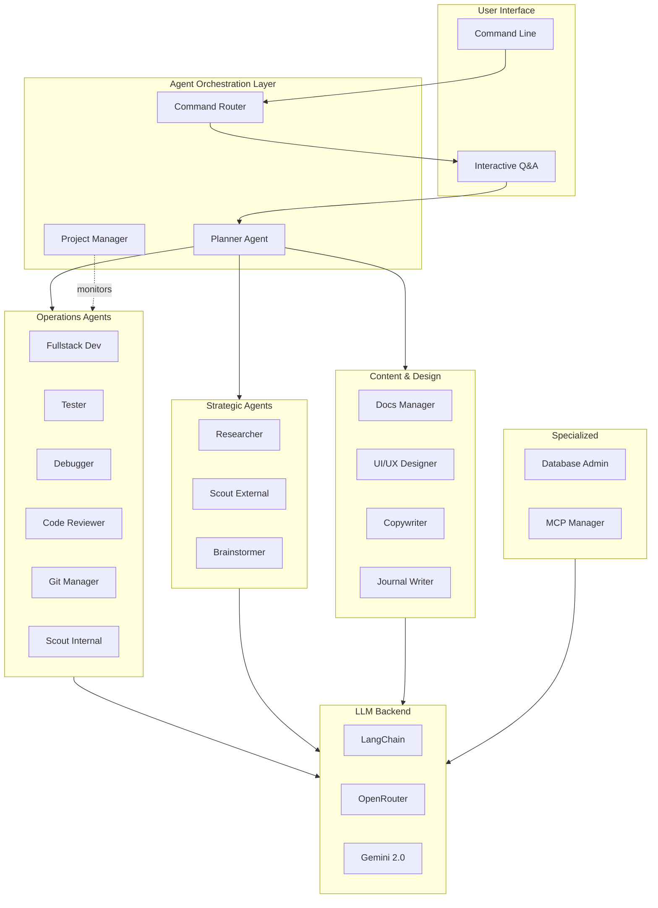
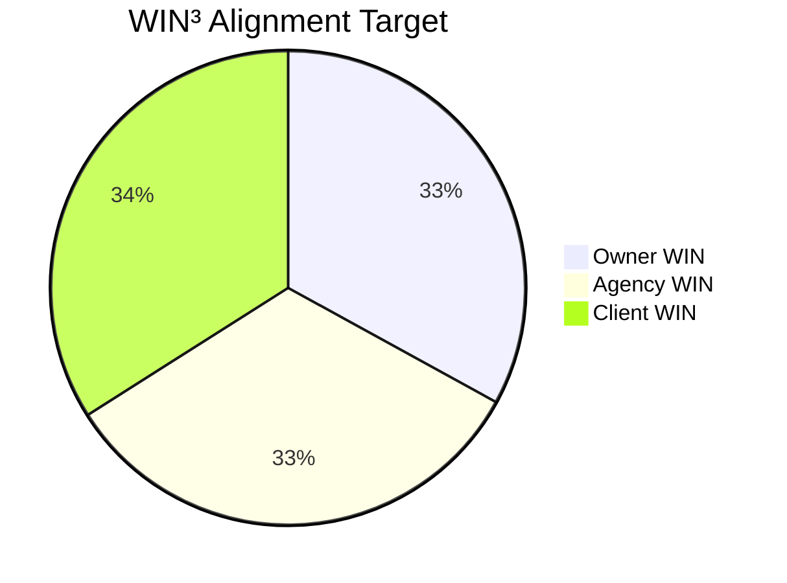

# System Architecture

AgencyOS is built on three pillars: **18 Specialized Agents**, **125+ Commands across 5 Business Suites**, and the **WIN³ Framework** for aligned success.

## Architecture Overview



---

## 18 Specialized Agents

### Agent Categories

| Category | Agents | Primary Function |
|----------|--------|------------------|
| **Strategic** (5) | planner, researcher, brainstormer, project-manager, scout-external | Planning, research, intelligence |
| **Operations** (6) | fullstack-developer, tester, debugger, code-reviewer, git-manager, scout-internal | Development, QA, version control |
| **Content** (4) | docs-manager, ui-ux-designer, copywriter, journal-writer | Documentation, design, marketing |
| **Specialized** (2) | database-admin, mcp-manager | Database, tool integration |

### Agent Collaboration Patterns

**Sequential Chain** (e.g., `/plan` → `/cook`):
```
planner → researcher → scout → developer → tester → reviewer → docs → git
```

**Parallel Execution** (e.g., `/cook:auto:parallel`):
```
         ┌─ developer (feature A)
planner ─┼─ developer (feature B)  ─→ tester → git
         └─ developer (feature C)
```

**Feedback Loop** (e.g., `/fix:hard`):
```
debugger ─→ developer ─→ tester
    ↑                       │
    └───── (if failed) ─────┘
```

---

## 125+ Commands: 5 Business Suites

### Suite Distribution

| Suite | Commands | Focus Area | Top Agents |
|-------|----------|------------|------------|
| 🔥 Marketing | ~25 | Growth, content, SEO | copywriter, scout-external, researcher |
| 💼 Sales | ~20 | CRM, pipeline, deals | researcher, planner, copywriter |
| 💰 Finance | ~15 | Budget, invoicing | planner, project-manager |
| 🏯 Strategic | ~20 | Planning, intel, crisis | planner, researcher, brainstormer |
| ⚡ Operations | ~45 | Dev, testing, docs | developer, tester, debugger, docs-manager |

### Command Families

**Operations Suite Deep Dive** (45 commands):
```
/cook              → Full feature development (8-agent workflow)
/code              → Code-only (no planning)
/bootstrap         → New project setup
/plan              → Planning only

/fix:fast          → Quick fixes (debugger + developer)
/fix:hard          → Complex debugging (all diagnostic agents)
/fix:test          → Test failure fixes
/fix:types         → TypeScript errors
/fix:ui            → UI/UX issues
/fix:ci            → CI/CD failures

/design:good       → WOW-level design
/design:fast       → Rapid prototyping
/design:3d         → 3D visualizations
/design:video      → Video animations
/design:screenshot → Screenshot → implementation

/docs:init         → Initialize documentation
/docs:update       → Update existing docs
/docs:summarize    → Generate summaries

/git:cm            → Conventional commits
/git:commit-push   → Commit + push
/git:pr            → Create pull request

/integrate:polar   → Polar.sh integration
/integrate:sepay   → SePay integration
/mcp:*             → MCP tool management
```

---

## Interactive Command Patterns

Every command follows a **5-9 question workflow** to gather context before execution.

### Example: `/ke-hoach-kinh-doanh` (Business Plan)

```
🏯 Bắt đầu Business Plan...

1. 📝 Tên dự án? | Project name?
   → "Mekong Fresh - Sàn nông sản sạch"

2. 🎯 Vấn đề giải quyết? | Problem solving?
   → "Nông dân bán giá thấp, người tiêu dùng mua giá cao"

3. 👥 Khách hàng mục tiêu? | Target customer?
   → "Hộ gia đình trung lưu, độ tuổi 25-45, Hà Nội"

4. 📍 Địa bàn hoạt động? | Location/Market?
   → "Hà Nội & các tỉnh Đồng bằng Bắc Bộ"

5. 💰 Mô hình doanh thu? | Revenue model?
   → "Commission 15% trên mỗi đơn hàng"

6. 🏆 Lợi thế cạnh tranh? | Competitive advantage?
   → "Truy xuất nguồn gốc blockchain + giao hàng 2h"

7. 💵 Vốn khởi điểm? | Startup capital?
   → "1.5 tỷ VNĐ (seed funding)"

8. 📊 Mục tiêu 12 tháng? | 12-month goal?
   → "10,000 đơn hàng/tháng, 200 hộ nông dân"

9. 👨‍💼 Team hiện tại? | Current team?
   → "3 co-founders (Tech, Ops, Marketing)"

✅ Generating comprehensive 13-chapter Binh Phap business plan...
```

**Output**: 50-page business plan covering:
- Market analysis (Kế Hoạch)
- Competitive landscape (Hình Thế)
- Go-to-market strategy (Mưu Công)
- Financial projections (Hư Thực)
- Risk mitigation (Cửu Biến)

---

## WIN³ Framework

**Alignment Model**: Every decision optimizes for 3 stakeholders



| Stakeholder | Metrics | Tools |
|-------------|---------|-------|
| **Owner WIN** | Deal flow, portfolio transparency | `/vc/portfolio`, `/dealflow` |
| **Agency WIN** | Revenue automation, cost reduction | `/finance/runway`, `/agentops` |
| **Client WIN** | Resource protection, valuation support | `/binh-phap`, `/crisis` |

**Command Examples by WIN³**:
- `/ke-hoach-kinh-doanh` → Creates plans that protect all 3 parties
- `/crisis` → Diagnoses issues from owner, agency, client perspectives
- `/finance/runway` → Alerts all parties on cash burn risks

---

## Technology Stack

| Component | Technology | Purpose |
|-----------|-----------|---------|
| **LLM** | OpenRouter + LangChain | Agent orchestration, context management |
| **Models** | Gemini 2.0 Flash, GPT-4o | Primary reasoning engines |
| **CLI** | Node.js + Commander.js | Command interface |
| **Config** | `.agencyos/` directory | Agents, commands, skills definitions |
| **Context** | MCP (Model Context Protocol) | Tool integration, memory |
| **Database** | Supabase PostgreSQL + RLS | State persistence, logs |

---

## Agent-Command Mapping Matrix

Quick reference: Which agents does each major command invoke?

| Command | Agents Invoked | Total |
|---------|---------------|-------|
| `/cook` | planner, scout, researcher, developer, tester, reviewer, docs, git, debugger, designer, brainstormer | 11 |
| `/bootstrap` | planner, researcher, developer, db-admin, tester, reviewer, docs, designer, git | 9 |
| `/fix:hard` | debugger, scout, researcher, db-admin, tester, developer | 6 |
| `/design:good` | designer, brainstormer, developer, docs | 4 |
| `/docs:update` | docs-manager, scout, reviewer | 3 |
| `/git:cm` | git-manager | 1 |
| `/ke-hoach-kinh-doanh` | planner, researcher, scout-external, copywriter, brainstormer | 5 |

---

## Next Steps

- **[Quick Start](/docs/getting-started/quick-start)** - Try the 5 Business Suites
- **[Commands Reference](/docs/commands)** - Explore all 125+ commands
- **[Agents Reference](/docs/agents)** - Deep dive into each agent
