# 🏯 AgencyOS Workflows

> **27 Workflows | 4 Phases | $1M Roadmap**
> **"Họ WIN → Mình WIN"**

---

## 🎯 Start Here: Pick Your Stage

| Your Current Revenue | Start With These |
|---------------------|------------------|
| **$0-$50K** (Freelancer) | [Sales Pipeline](#-phase-1-foundation) → [Pricing Strategy](#-phase-1-foundation) |
| **$50K-$200K** (Small Agency) | [Client Onboarding](#-phase-1-foundation) → [Finance Reporting](#-phase-2-scaling) |
| **$200K-$500K** (Growing) | [HR Hiring](#-phase-2-scaling) → [Industry Workflows](#-phase-3-expansion) |
| **$500K+** (Scale) | [Community Guild](#-phase-4-dominance) → [Customer Success](#-phase-4-dominance) |

---

## 📊 $1M Roadmap Overview

```mermaid
graph LR
    subgraph Phase1["🏗️ Phase 1: Foundation"]
        A1[Sales Pipeline]
        A2[Client Onboarding]
        A3[Pricing Strategy]
    end
    
    subgraph Phase2["📈 Phase 2: Scaling"]
        B1[Finance Reporting]
        B2[HR Hiring]
        B3[Content Calendar]
    end
    
    subgraph Phase3["🌍 Phase 3: Expansion"]
        C1[Industry Workflows]
        C2[7 Verticals]
    end
    
    subgraph Phase4["🏆 Phase 4: Dominance"]
        D1[Community Guild]
        D2[Customer Success]
    end
    
    Phase1 --> Phase2 --> Phase3 --> Phase4
    
    style Phase1 fill:#10b981,color:#fff
    style Phase2 fill:#3b82f6,color:#fff
    style Phase3 fill:#8b5cf6,color:#fff
    style Phase4 fill:#f59e0b,color:#fff
```



---

## 🏗️ Phase 1: Foundation

> **Target**: $0 → $100K ARR | 10 Clients

### Business Operations (5)

| Workflow | What You'll Learn |
|----------|-------------------|
| [Sales Pipeline](/docs/workflows/sales-pipeline) | Convert leads to clients |
| [Client Onboarding](/docs/workflows/client-onboarding) | First 90 days success |
| [Proposal to Close](/docs/workflows/proposal-to-close) | Win deals faster |
| [Pricing Strategy](/docs/workflows/pricing-strategy) | Design profitable tiers |
| [Retention Plays](/docs/workflows/retention-plays) | Reduce churn |

### Strategic (3)

| Workflow | What You'll Learn |
|----------|-------------------|
| [Binh Pháp Analysis](/docs/workflows/binh-phap-analysis) | Sun Tzu for business |
| [VC Readiness](/docs/workflows/vc-readiness) | Prepare for fundraising |
| [MVP Launch](/docs/workflows/mvp-launch) | Ship products fast |

---

## 📈 Phase 2: Scaling

> **Target**: $100K → $200K ARR | 30 Clients

### Business (3)

| Workflow | What You'll Learn |
|----------|-------------------|
| [Finance Reporting](/docs/workflows/finance-reporting) | P&L and cash flow |
| [HR Hiring](/docs/workflows/hr-hiring) | Build your team |
| [Legal Contracts](/docs/workflows/legal-contracts) | MSA, NDA, SOW |

### Creative (3)

| Workflow | What You'll Learn |
|----------|-------------------|
| [Content Calendar](/docs/workflows/content-calendar) | Content marketing |
| [Video Workflow](/docs/workflows/video-workflow) | Video production |
| [Brand System](/docs/workflows/brand-system) | Brand guidelines |

### Multi-Agent (3)

| Workflow | What You'll Learn |
|----------|-------------------|
| [Supervisor Pattern](/docs/workflows/supervisor-pattern) | Multi-agent AI |
| [Workflow Chain](/docs/workflows/workflow-chain) | VoltAgent automation |
| [Human-in-Loop](/docs/workflows/human-in-loop) | Approval workflows |

---

## 🌍 Phase 3: Expansion

> **Target**: $200K → $450K ARR | 45 Clients

### Industry Verticals (7)

| Workflow | Industry |
|----------|----------|
| [Retail E-commerce](/docs/workflows/retail-ecommerce) | E-commerce |
| [Real Estate CRM](/docs/workflows/real-estate-crm) | Real Estate |
| [Education LMS](/docs/workflows/education-lms) | Ed-Tech |
| [Wellness HIPAA](/docs/workflows/wellness-hipaa) | Healthcare |
| [Insurance Claims](/docs/workflows/insurance-claims) | Insurance |
| [Manufacturing](/docs/workflows/manufacturing) | Industrial |
| [Government](/docs/workflows/government) | Public Sector |

---

## 🏆 Phase 4: Dominance

> **Target**: $450K → $1M ARR | 60 Clients

### Community (3)

| Workflow | What You'll Learn |
|----------|-------------------|
| [Virtual Events](/docs/workflows/events-virtual) | Events & webinars |
| [Community Guild](/docs/workflows/community-guild) | Member network |
| [Customer Success](/docs/workflows/customer-success) | NRR optimization |

---

## 🚀 Quick Commands

```bash
# Start a workflow
mekong workflow start sales-pipeline

# View workflow status
mekong workflow status

# List all workflows
mekong workflow list
```

---

## 📚 All 27 Workflows

<details>
<summary><strong>Phase 1: Foundation (8)</strong></summary>

1. `sales-pipeline.md` - Lead to client
2. `client-onboarding.md` - First 90 days
3. `proposal-to-close.md` - Win deals
4. `pricing-strategy.md` - Tier design
5. `retention-plays.md` - Churn prevention
6. `binh-phap-analysis.md` - Strategy
7. `vc-readiness.md` - Fundraising
8. `mvp-launch.md` - Product launch

</details>

<details>
<summary><strong>Phase 2: Scaling (9)</strong></summary>

1. `finance-reporting.md` - P&L tracking
2. `hr-hiring.md` - Team building
3. `legal-contracts.md` - MSA/NDA
4. `content-calendar.md` - Content ops
5. `video-workflow.md` - Video production
6. `brand-system.md` - Brand guidelines
7. `supervisor-pattern.md` - Multi-agent
8. `workflow-chain.md` - VoltAgent
9. `human-in-loop.md` - Approvals

</details>

<details>
<summary><strong>Phase 3: Expansion (7)</strong></summary>

1. `retail-ecommerce.md` - E-commerce
2. `real-estate-crm.md` - Real Estate
3. `education-lms.md` - Ed-Tech
4. `wellness-hipaa.md` - Healthcare
5. `insurance-claims.md` - Insurance
6. `manufacturing.md` - Industrial
7. `government.md` - Government

</details>

<details>
<summary><strong>Phase 4: Dominance (3)</strong></summary>

1. `events-virtual.md` - Events
2. `community-guild.md` - Community
3. `customer-success.md` - Success

</details>

---

## 🏯 Binh Pháp Alignment

> **"Tri bỉ tri kỉ, bách chiến bách thắng"**
> Know enemy, know self = 100 battles, 100 victories

Each workflow is aligned with Sun Tzu's 13 Chapters for strategic advantage.

---

## Need Help?

- [Getting Started](/docs/getting-started) - AgencyOS basics
- [Commands Reference](/docs/commands) - All CLI commands
- [Support](/docs/support) - Community help

---

**🏯 "Họ WIN → Mình WIN → $1M ARR"**
